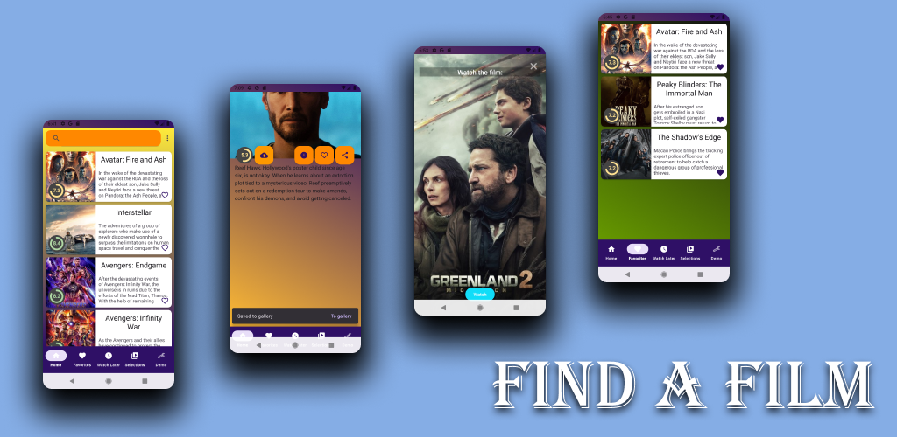
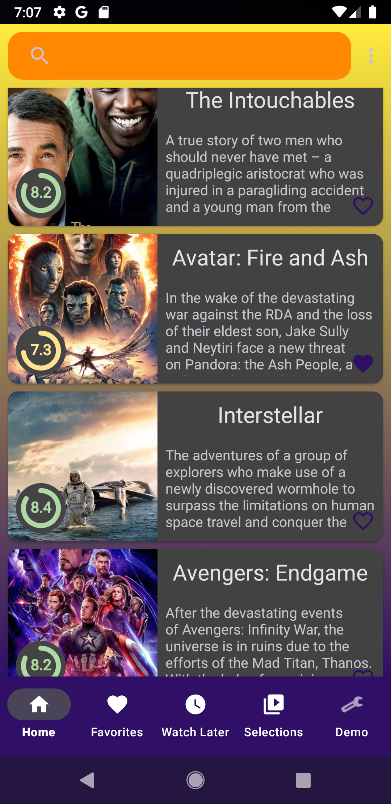
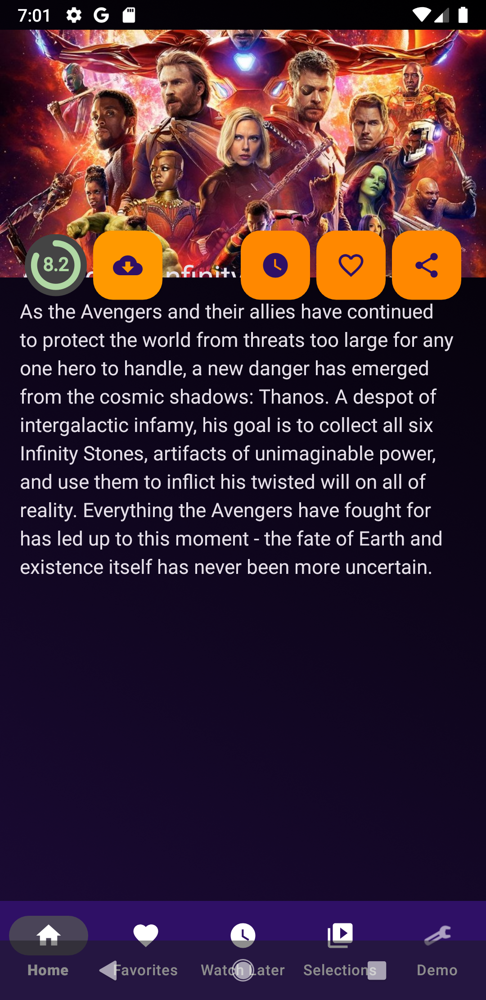
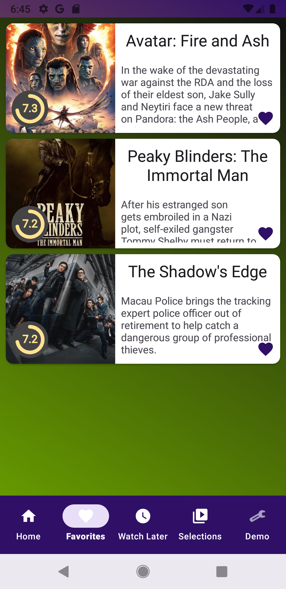

# Find A Film

Приложение для удобного поиска фильмов и сериалов с использованием стороннего API (TMDB).

## 📱 Скриншоты

### Промо (из Play Console)

### Интерфейс

|             Главный экран (темная тема)             |               Описание фильма (темная тема)                |                      Избранное                      |
|:---------------------------------------------------:|:----------------------------------------------------------:|:---------------------------------------------------:|
|  |  |  |

## 🛠 Стек технологий
* **Язык:** Kotlin
* **Архитектура:** MVVM (Model-View-ViewModel) + Clean Architecture
* **Асинхронность:** RxJava 3
* **Сеть:** Retrofit 2 + Gson
* **База данных:** Room (кэширование и список избранного)
* **UI:** XML (View Binding), Material Design, Glide (для загрузки картинок)
* **Paging:** Paging 3 (RxJava 3 support)
* **DI:** Koin / Dagger 2

## 🌟 Основной функционал
* Поиск фильмов по названию с оптимизацией запросов (`debounce`).
* Выбор различных категорий фильмов (Популярные, Ожидаемые и т.д.).
* Сохранение карточек в локальную БД для офлайн-доступа и списка избранного.
* Плавная подгрузка данных с помощью библиотеки Paging.
* Подробное описание каждого фильма, включая рейтинг и постер.
* Поддержка уведомлений через `ReminderBroadcast`.
* Разделение на модули (`remote_module`, `database_module`) для лучшей поддерживаемости.

## 📦 Сборка и установка
1. Клонируйте репозиторий: `git clone https://github.com/ваш_логин/Music-Wave.git`
2. Откройте проект в Android Studio.
3. Дождитесь завершения Gradle Sync.
4. Соберите и запустите приложение на эмуляторе или реальном устройстве.

---
*Разработано с использованием API TMDB.*

